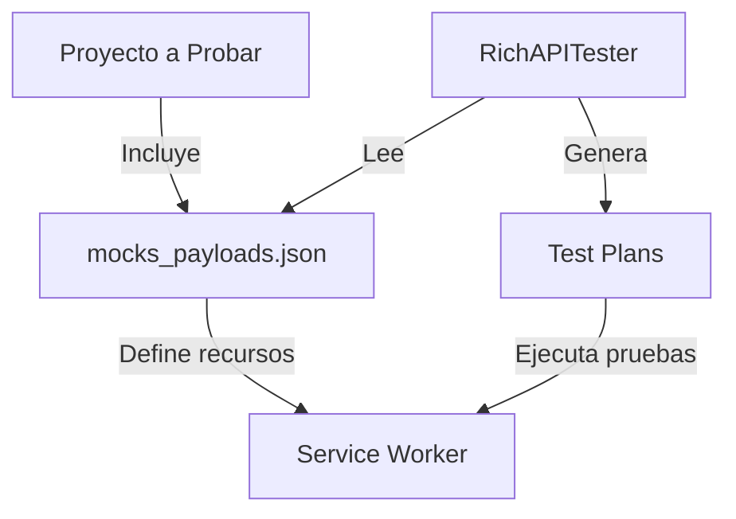

# RichAPITester (RAT)

RichAPITester (RAT) es una aplicación basada en Electron diseñada para probar recursos de APIs mockeadas mediante Service Workers. Permite realizar pruebas unitarias e integradas sobre endpoints simulados, facilitando el desarrollo y la validación de comportamientos de API sin necesidad de un backend real.

## Características

- **Pruebas Unitarias e Integradas:** Ejecuta tests contra endpoints mockeados.
- **Mocks con Service Workers:** Utiliza Service Workers para simular respuestas de API.
- **Interfaz Intuitiva:** Basada en Electron, permite una rápida configuración y ejecución de pruebas.
- **En Desarrollo:** Este proyecto se encuentra en fase activa de desarrollo.

## Requisitos

- [Node.js](https://nodejs.org/) (se recomienda versión 12 o superior)
- [Electron](https://www.electronjs.org/)

## Instalación

Clona el repositorio e instala las dependencias:

```bash
git clone https://github.com/tu-usuario/RichAPITester.git
cd RichAPITester
npm install
```

## Uso

Para iniciar la aplicación en modo desarrollo:

```bash
npm start
```

## Arquitectura y Requisitos

RichAPITester está diseñado para integrarse en aplicaciones web, permitiendo realizar pruebas unitarias e integradas sobre APIs mockeadas. Para ello, se requiere que el proyecto a probar incluya un archivo `mocks_payloads.json` que defina los recursos y endpoints REST simulados. Este archivo es fundamental, ya que:

- **Fuente de Recursos:** El archivo mocks_payloads.json se importa en la aplicación y proporciona la información necesaria para generar test plans basados en los endpoints y payloads definidos.

## Ejemplo de mocks_payloads.json

Para que RichAPITester pueda generar los test plans correctamente, es imprescindible que el proyecto a probar incluya un archivo llamado `mocks_payloads.json` en la raíz del sitio web (por ejemplo, al mismo nivel que el `index.html`). Este archivo debe contener la definición de los endpoints y los payloads de ejemplo.

A continuación, se muestra un ejemplo simple:

```json
[
  {
    "method": "GET",
    "path": "/api/users",
    "description": "Obtiene la lista de usuarios",
    "payloadExample": {
      "users": [
        { "id": 1, "name": "Alice" },
        { "id": 2, "name": "Bob" }
      ]
    }
  },
  {
    "method": "POST",
    "path": "/api/users",
    "description": "Crea un nuevo usuario",
    "payloadExample": {
      "id": 3,
      "name": "Charlie"
    }
  }
]
```

- **Ubicación del Archivo**
  El archivo mocks_payloads.json debe estar ubicado en la raíz del proyecto o en el nivel de las páginas estáticas (por ejemplo, en GitHub Pages, junto a index.html). Esto garantiza que RichAPITester pueda leer el archivo de forma correcta y utilizar su contenido para simular los endpoints durante las pruebas.

- **Integración con Service Workers:** Permite que el Service Worker simule las respuestas de la API, facilitando la ejecución de pruebas sin un backend real.

### Diagrama de Arquitectura

A continuación, se muestra un diagrama que ilustra cómo se integran los diferentes componentes:



## Contribuciones

Las contribuciones son bienvenidas. Si deseas reportar un problema o enviar mejoras, por favor abre un issue o un pull request.

## Licencia

Este proyecto está licenciado bajo la Licencia MIT.
